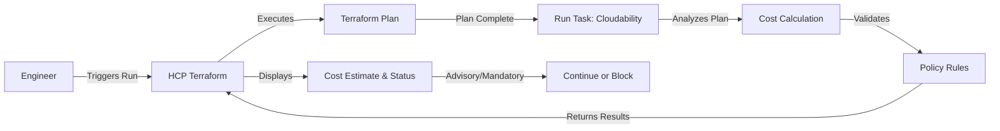

# IBM Cloudability + HCP Terraform Integration Demo

A demonstration of proactive FinOps practices using IBM Cloudability's Governance feature integrated with HCP Terraform via Run Tasks to provide pre-deployment cost visibility and policy enforcement.

## 🎯 Overview

This demo showcases how Cloudability integrates with HCP Terraform using **Run Tasks** to deliver:

- **Pre-deployment cost estimates** - See personalized spend projections during Terraform plan phase before infrastructure is deployed
- **Policy enforcement** - Automatically validate tagging requirements and approved instance families in the Terraform workflow
- **Post-deployment optimization** - Monitor actual costs and identify waste based on real utilization patterns
- **Continuous improvement** - Feed optimization recommendations back into the Terraform workflow

**The Goal**: Shift cost awareness left into the engineering workflow, preventing expensive mistakes before they reach production.

## 🔄 What is a Terraform Run Task?

Terraform Run Tasks allow you to integrate third-party tools directly into the HCP Terraform workflow. When enabled, Cloudability automatically:

1. **Receives Terraform plan data** during the plan phase
2. **Analyzes proposed infrastructure changes** for cost impact
3. **Validates against governance policies** (tagging, instance types, etc.)
4. **Returns results to HCP Terraform** before apply
5. **Can block or warn** based on policy violations or cost thresholds

This native integration means cost governance happens automatically in every Terraform run—no separate tools or manual reviews required.

## 📋 What This Demo Includes

This repository contains a sample Terraform configuration that provisions:

- **EC2 Instance** (t2.small) - Web server with cost-center tagging
- **S3 Bucket** - Application data storage
- **EBS Volume** (100GB gp3) - Persistent storage attached to EC2
- **RDS MySQL Database** (db.t3.micro) - Application database
- **Application Load Balancer** - With target group and listener
- **Security Groups** - Network access controls

All resources are tagged for proper cost allocation and demonstrate Cloudability's governance capabilities.

## 🔑 Key Features

### Native HCP Terraform Integration

- **Run Task Integration** - Cloudability registers as a Run Task in HCP Terraform
- **Automatic Analysis** - Cost estimation happens during every Terraform plan
- **Workflow Integration** - Results appear directly in the HCP Terraform UI
- **No Code Changes** - Works with existing Terraform configurations

### Personalized Cost Estimates

- **Organization Pricing** - Uses your actual AWS pricing, including Reserved Instances and Savings Plans
- **Commitment Data** - Factors in existing commitments for accurate projections
- **Monthly Estimates** - Shows expected monthly cost impact of proposed changes
- **Resource-Level Detail** - Breaks down costs by individual resources

### Policy Enforcement

- **Tagging Requirements** - Enforce required tags like cost-center, environment, owner
- **Instance Family Controls** - Restrict to approved instance types (e.g., t3, m5, c5)
- **Configurable Actions** - Choose to block deployments or provide warnings
- **Clear Feedback** - Engineers see exactly what needs to be fixed

### Post-Deployment Insights

- **Near Real-Time Monitoring** - Track actual spend vs. estimates
- **Waste Detection** - Identify idle resources and rightsizing opportunities
- **Budget Tracking** - Monitor spend against established thresholds
- **Utilization Analysis** - Understand actual resource usage patterns

## 🚀 Quick Start

### Prerequisites

- HCP Terraform account (free tier works)
- AWS account with appropriate permissions
- GitHub account
- IBM Cloudability account with Governance feature enabled

### 1. Fork and Clone Repository

```bash
git clone https://github.com/StevenJohnWeaver/TF-Cloudability-Demo-0925.git
cd TF-Cloudability-Demo-0925
```

### 2. Configure HCP Terraform Workspace

1. **Create workspace** in HCP Terraform:
   - Organization: `steve-weaver-demo-org`
   - Workspace: `TF-Cloudability-0925`
   - Execution mode: Remote

2. **Connect to VCS** (optional):
   - Link to your forked GitHub repository
   - Or use CLI/API-driven workflow

3. **Configure AWS credentials**:
   - Set `AWS_ACCESS_KEY_ID` and `AWS_SECRET_ACCESS_KEY` as environment variables
   - Or use dynamic credentials with OIDC

4. **Set execution mode**:
   - Auto-apply for demos
   - Manual approval for production

### 3. Enable Cloudability Run Task

1. **In Cloudability**, navigate to **Governance** → **Integrations**

2. **Configure HCP Terraform Integration**:
   - Generate Run Task URL and HMAC key
   - Note the webhook URL (e.g., `https://api.cloudability.com/v3/terraform/run-tasks`)

3. **In HCP Terraform**, go to **Organization Settings** → **Run Tasks**:
   - Click **Create Run Task**
   - Name: `Cloudability Cost Governance`
   - Endpoint URL: (from Cloudability)
   - HMAC Key: (from Cloudability)
   - Stage: **Post-plan**
   - Enforcement Level: **Advisory** (or Mandatory to block on violations)

4. **Associate with Workspace**:
   - Go to workspace **Settings** → **Run Tasks**
   - Enable the Cloudability run task
   - Set enforcement level (Advisory or Mandatory)

### 4. Configure Governance Policies

In Cloudability, set up policy rules:

1. **Tagging Requirements**:
   - Required tags: `cost-center`, `Environment`
   - Enforcement: Warning or Block

2. **Instance Type Controls**:
   - Approved families: `t2`, `t3`, `m5`, `c5`
   - Block unapproved types

3. **Cost Thresholds** (optional):
   - Maximum monthly increase: $100
   - Alert on significant changes

### 5. Test the Integration

Trigger a Terraform run to see Cloudability in action:

```bash
# Make a change to main.tf
# For example, change instance type from t2.small to t2.large

# Queue a plan in HCP Terraform (via VCS push, CLI, or UI)
terraform plan
```

In the HCP Terraform UI, observe:
- Run progresses through plan phase
- Cloudability Run Task executes post-plan
- Cost estimate appears in run details
- Policy validation results displayed
- Run continues or blocks based on enforcement level

## 📁 Repository Structure

```
.
├── main.tf                    # Main Terraform configuration
├── README.md                  # This file
└── .gitignore                 # Git ignore patterns
```

## 🎬 Demo Flow

### Phase 1: Pre-Deployment Cost Visibility (Run Task)



1. **Engineer triggers Terraform run** (via VCS push, CLI, or UI)
2. **HCP Terraform executes plan** phase
3. **Cloudability Run Task activates** post-plan
4. **Plan data sent to Cloudability** for analysis
5. **Cost estimate calculated** with:
   - Monthly cost projection
   - Cost comparison to current state
   - Resource-level breakdown
6. **Policy validation** checks:
   - Required tags present
   - Instance types approved
   - Compliance with organizational standards
7. **Results returned to HCP Terraform**:
   - Advisory: Shows warning, allows apply
   - Mandatory: Blocks apply if policies fail

### Phase 2: Review and Apply

1. **Team reviews** cost estimate and policy results in HCP Terraform UI
2. **Engineer addresses** any policy violations if needed
3. **Run is approved** (if manual approval required)
4. **HCP Terraform** applies changes
5. **Infrastructure deployed** to AWS

### Phase 3: Post-Deployment Optimization

1. **Cloudability monitors** actual resource utilization
2. **Waste detection** identifies:
   - Idle EC2 instances (low CPU/network)
   - Unattached EBS volumes
   - Oversized databases
3. **Recommendations** fed back into next Terraform iteration
4. **Continuous improvement** cycle established

## 🔧 Configuration Examples

### Tagging Strategy

All resources include required tags for cost allocation:

```hcl
tags = {
  Name        = "HelloWorldServer"
  cost-center = "dev"
  Environment = "Demo"
  Purpose     = "CostEstimation"
}
```

### Instance Type Selection

Demo uses cost-effective instance types:

```hcl
resource "aws_instance" "web" {
  ami           = "ami-0de716d6197524dd9"
  instance_type = "t2.small"  # Right-sized for demo workload
  # ...
}
```

### Storage Optimization

EBS volume configured with gp3 for better price/performance:

```hcl
resource "aws_ebs_volume" "web_data" {
  availability_zone = "us-east-1a"
  size              = 100
  type              = "gp3"  # More cost-effective than gp2
  # ...
}
```

## 📊 Cost Estimation Example

When you trigger a Terraform run that changes the instance type from `t2.small` to `t2.large`, Cloudability Run Task will display in HCP Terraform:

```
💰 Cloudability Cost Governance - Advisory

Monthly Cost Impact: +$30.40

Resource Changes:
• aws_instance.web
  - Current: t2.small ($16.79/month)
  - Proposed: t2.large ($47.19/month)
  - Increase: +$30.40/month (+181%)

Total Estimated Monthly Cost: $127.85
Previous Monthly Cost: $97.45

✅ Policy Validation: Passed
• Required tags present: cost-center, Environment
• Instance type approved: t2.large is in allowed families

Status: Passed (Advisory)
The run can proceed to apply phase.
```

This information appears in the **Run Tasks** section of your Terraform run in the HCP Terraform UI.

## 🧪 Testing Scenarios

### Scenario 1: Cost-Effective Change

Change instance type from `t2.small` to `t3.small`:
- **Expected**: Lower cost estimate (t3 is more efficient)
- **Policy**: Passes (t3 is approved family)

### Scenario 2: Expensive Change

Change instance type from `t2.small` to `m5.4xlarge`:
- **Expected**: Significant cost increase warning
- **Policy**: Passes (m5 is approved family)
- **Discussion**: Team reviews if performance justifies cost

### Scenario 3: Policy Violation

Add resource without required tags:
- **Expected**: Policy validation fails
- **Action**: Cloudability blocks or warns
- **Resolution**: Engineer adds required tags


## 🐛 Troubleshooting

### Cloudability Run Task Not Executing

1. Verify Run Task is configured in HCP Terraform organization settings
2. Check Run Task is enabled for the specific workspace
3. Ensure HMAC key matches between Cloudability and HCP Terraform
4. Review run logs in HCP Terraform for Run Task errors
5. Check Cloudability integration status in Governance settings

### Cost Estimates Seem Inaccurate

1. Verify AWS account is connected to Cloudability
2. Check that pricing data is up to date
3. Ensure Reserved Instances and Savings Plans are configured
4. Contact Cloudability support for pricing sync

### Policy Validation Not Working

1. Review policy rules in Cloudability Governance settings
2. Verify rule syntax and conditions
3. Check enforcement level in Run Task configuration (Advisory vs. Mandatory)
4. Ensure policies are enabled and active
5. Test with a simple rule first (e.g., single required tag)

## 📚 Documentation

### IBM Cloudability

- [Cloudability Documentation](https://www.ibm.com/docs/en/cloudability)
- [HCP Terraform Run Task Integration Guide](https://www.ibm.com/docs/en/cloudability-commercial/cloudability-standard/saas?topic=governance-hcp-terraformterraform-enterprise)
- [Terraform Run Tasks Documentation](https://developer.hashicorp.com/terraform/cloud-docs/integrations/run-tasks)
- [Governance Feature Overview](https://www.ibm.com/docs/en/cloudability)

### HashiCorp

- [HCP Terraform Documentation](https://developer.hashicorp.com/terraform/cloud-docs)
- [Terraform AWS Provider](https://registry.terraform.io/providers/hashicorp/aws/latest/docs)
- [Terraform Best Practices](https://developer.hashicorp.com/terraform/cloud-docs/recommended-practices)
- [Run Tasks API](https://developer.hashicorp.com/terraform/cloud-docs/api-docs/run-tasks)

### Related Resources

- [Blog: Better Together - Terraform and Cloudability](blog-terraform-cloudability-better-together.md)
- [FinOps Foundation](https://www.finops.org/)
- [AWS Cost Optimization](https://aws.amazon.com/aws-cost-management/)

## 💡 Best Practices

### 1. Establish Tagging Standards

Define required tags early:
- `cost-center` - For chargeback
- `Environment` - dev, staging, prod
- `Owner` - Team or individual responsible
- `Project` - Business initiative

### 2. Set Realistic Budgets

Use Cloudability estimates to:
- Establish baseline costs
- Set monthly budget thresholds
- Configure alerts for anomalies
- Track cost trends over time

### 3. Review Cost Estimates

Make cost review part of PR process:
- Require approval for significant increases
- Document cost justifications
- Consider alternatives (e.g., Reserved Instances)
- Plan for cost optimization

### 4. Act on Recommendations

Use post-deployment insights:
- Schedule regular waste reviews
- Implement rightsizing recommendations
- Automate cleanup of idle resources
- Track optimization savings

### 5. Iterate and Improve

Create continuous improvement cycle:
- Review actual vs. estimated costs
- Refine tagging strategy
- Update policy rules
- Share learnings across teams

## 🔗 Additional Resources

### Related Demos

- [Terraform + Ansible Automation Platform](https://github.com/StevenJohnWeaver/TF-AAP-Actions-Bob-Demo)
- [Terraform + IBM Turbonomic](https://github.com/StevenJohnWeaver/TF-Turbonomic-Demo)

---

**Version**: 1.0  
**Last Updated**: 2026-05-22  
**Maintained By**: Steve Weaver  
**Repository**: https://github.com/StevenJohnWeaver/TF-Cloudability-Demo-0925
